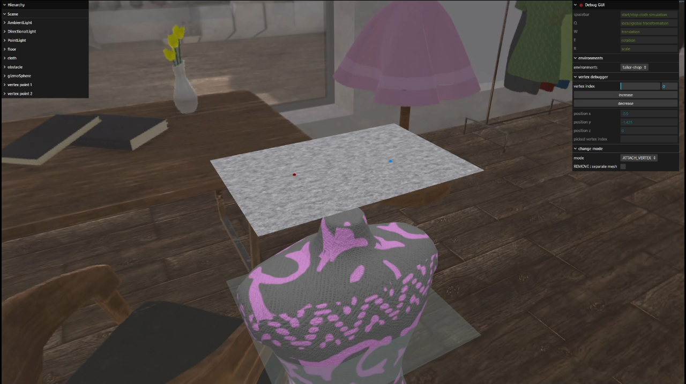
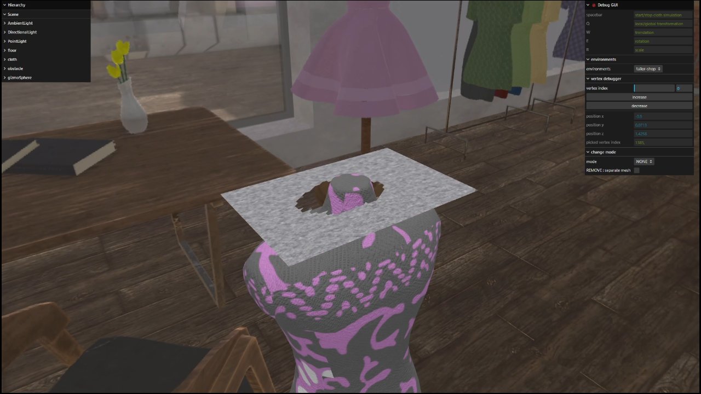
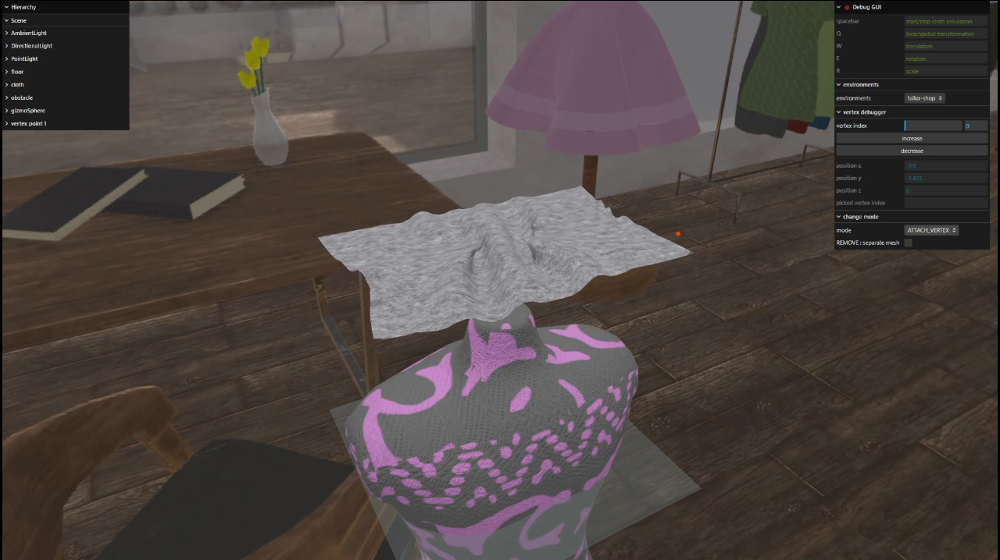
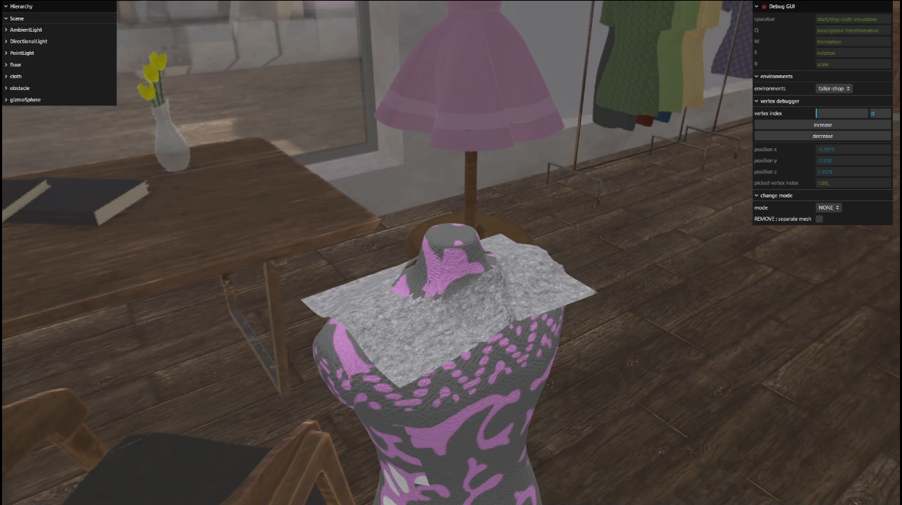
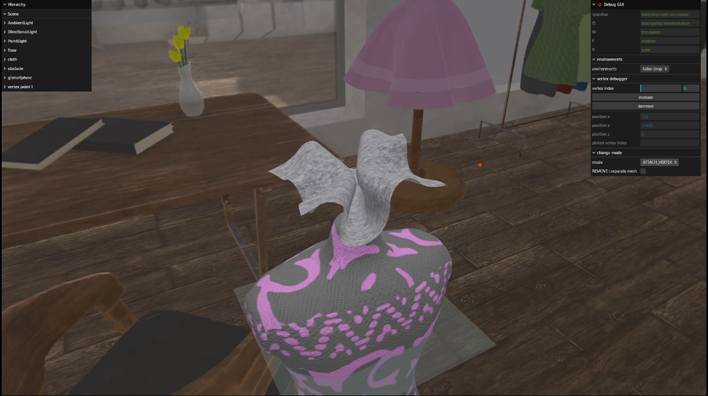
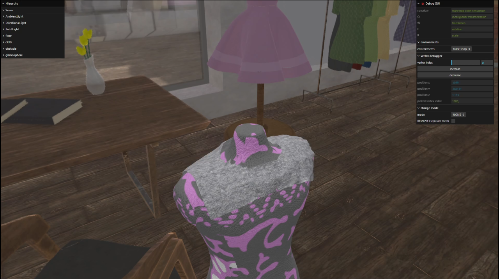

# Three.js Cloth Tailor
### gif 파일이 많아, 로딩 시간이 오래 걸릴 수 있습니다. / There are many gif files, so it may take a long time to load.
<p style="display: flex; flex-wrap: wrap; gap: 0px; justify-content: space-around;">
  
  
  
  
  
  
</p>

## Physical Based Dynamics simulation


## Remove vertex mode


## Remove edge(Cut along with edge) mode


## Expand vertex mode
<p style="display: flex; flex-wrap: wrap; gap: 10px; justify-content: space-around;">
  
  
  
  
</p>

## Attach vertex mode
<p style="display: flex; flex-wrap: wrap; gap: 10px; justify-content: space-around;">
  
  
  
  
</p>

## Transform GUI & Cut geometry divide mesh


## Virtual cloth drape
<p style="display: flex; flex-wrap: wrap; gap: 10px; justify-content: space-around;">
  
  
  
  
  
  
  
</p>

# How to Run
## Tech Stack

- Three.js
- TypeScript
- Vite

## CLI Commands

Installation

```bash
npm i
```

Run dev mode

```bash
npm run dev
```

Build

```bash
npm run build
```

Run build

```bash
npm run preview
```

Test Start
```bash
npm vite
```
(if you install vite to local directory you need to use npx)